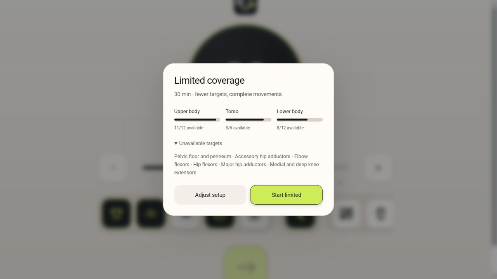
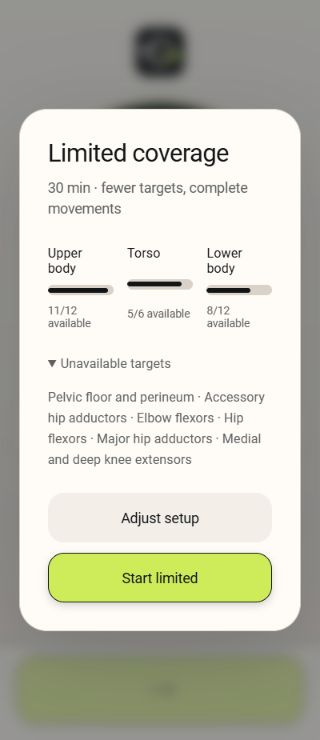
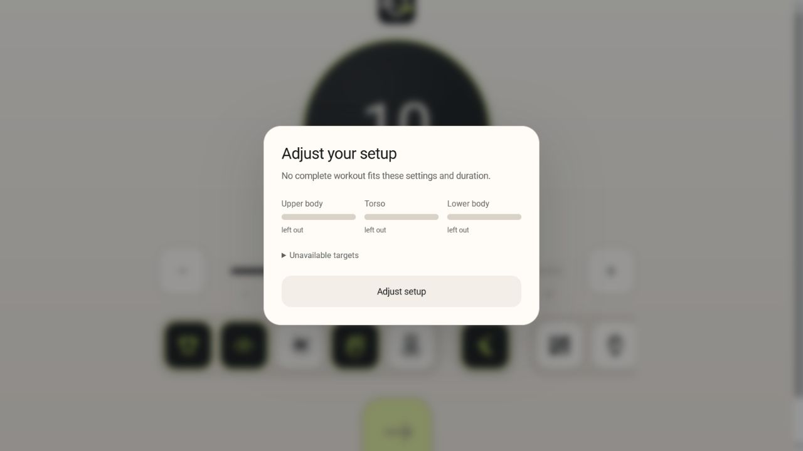

# Workout availability release validation

Validated on 2026-09-11 for Flux 3.11 / Android version 125.

- Android: 753 tests passed, including the shared availability cases, strict Light transitions, legacy-history preservation, primary rotation, Oura protections, and nullable legacy state.
- Web: 338 tests passed, including every production profile shard and native/web contract checks.
- Production build: 639 files, 38.34 MiB, 539 exercises, no GIF runtime payload.
- Android Debug: built with installed .NET SDK 10.0.303. The connected-device check returned no devices; phone installation is pending.
- Catalog: all 539 retained entries matched their complete passing metadata and runtime-asset reviews. Raw exercises.json SHA-256: `d243d9dae5aec52da24934a61fd9bc6cb0be122521b6e7a1be8d50a57faba10a`.
- Semantic audits passed for mirror relationships, session movement identity, exact secondary claims, global primary coverage, Hard Floor, source definitions, and review-evidence invalidation.
- Availability report: 640 sampled duration/setup/Light contexts; 219 full scope, 421 requiring acceptance, zero blocked in the approved catalog. This is a reproducible sample over the existing quadratic profiles plus real setup combinations, not a universal availability guarantee.

Browser verification exercised cancellation back to unchanged setup, expandable missing targets, accepted Light start, playback and pause, and a blocked-start fixture. Layout was inspected at desktop, 360 px and 320 px widths. The blocked screenshot uses a separate synthetic demand-only catalog served outside the checkout; approved runtime assets and metadata were never modified for that test.

The web product has the same selection, history, consent and physical-constraint behavior as Android. Native Oura stays on the phone. Native initialization normalizes nullable state before inspecting an older plan; the web constructor already performs that normalization before its upgrade logic.
